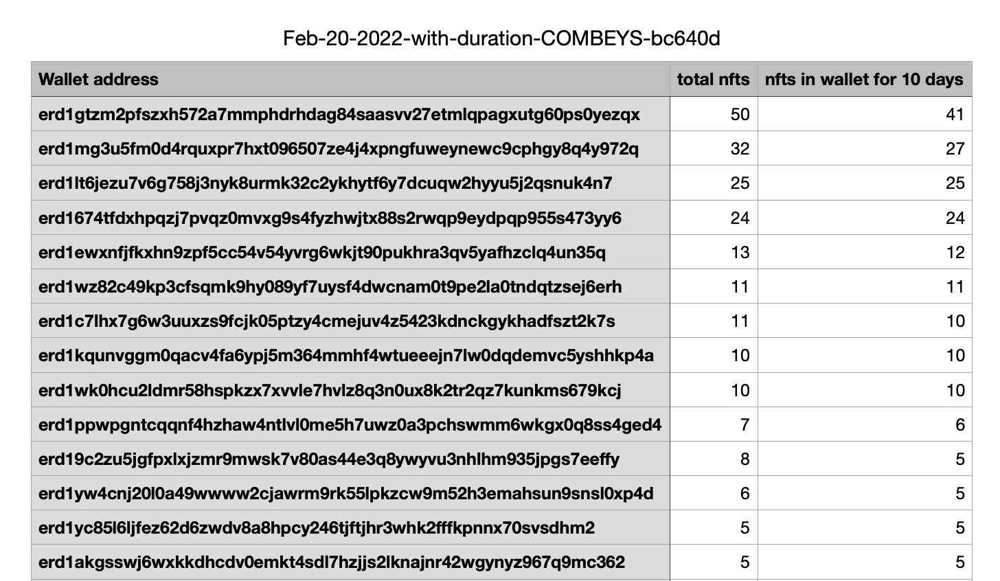

### elrond-lkmex-distribution

**The script for distributing LKMEX (or any other [ESDT](https://docs.elrond.com/developers/esdt-tokens/) token!) to all Your NFTs collection holders 😎!**

[//]: # (Inspired by the [Elrond script utils]&#40;https://github.com/ElrondNetwork/script-utils&#41; &#40;we'll unify our scripts in near future&#41;.)

**Now, we also support NFTs holders' reports, which is huge! Read [here](#nfts-holder-report)** 😇.

## Table of contents
* [LKMEX Script](#lkmex-script)
  * [How it works](#how-it-works)
  * [Getting started](#getting-started)
  * [Generation based on duration of holding](#generation-based-on-duration-of-holding)
  * [Generation based on NFTs attributes](#generation-based-on-nfts-attributes)
* [NFTs holder report](#nfts-holder-report)
  * [How it works](#how-it-works)
  * [Getting started](#getting-started)
  
  
## LKMEX Script
#### How it works
The script gets the addresses from all collection holders; it excludes **marketplaces** and the owner address/SC address.

Then it distributes your **total** provided LKMEX (ESDT token) for all NFTs holders. The more NFTs the wallet address has - the more LKMEX it gets 🤑.

#### Getting started

You need to interact only with the **distribute.sh** file.

To make this distribution work for your NFTs collection you can configure it like this:

##### 1. Configuring Python
You need to have Python installed on your machine or in the virtual environment 🤓.

Check your Python version by running:

```shell
$ python3 --version
```

Then you should modify the **distribute.sh** script to match your Python version: 

**PYTHON_BINARY=python3.8**

After that run

```shell
$ pip install -r requirements.txt
```

##### 2. Provide the wallet.pem file
You need to generate a wallet.pem file from your secret seed phrase. You can read [here](https://docs.elrond.com/sdk-and-tools/erdpy/deriving-the-wallet-pem-file/) (**check the warning**).

##### 3. Modifying the constants

You need to modify the following constants:

```shell
# Identifier of the collection. Check the collection row https://explorer.elrond.com/collections/COMBEYS-bc640d
NFT_COLLECTION_IDENTIFIER=Your collection identifier
# Null if Smart Contract does not hold NFTs for distribution. Provide an address if it holds.
SMART_CONTRACT_ADDRESS=null
# The collection identifier of the tokens that will be distributed. Check the collection row in the example: https://explorer.elrond.com/nfts/LKMEX-aab910-22e4ef
TOKEN_COLLECTION_IDENTIFIER=LKMEX-aab910
# Check the identifier row and extract the nonce. As an example: LKMEX-aab910-22e4ef has the nonce 22e4ef 
TOKEN_NONCE=22e4ef
# The number of decimals of the token. Check the decimals row in the example: https://explorer.elrond.com/nfts/LKMEX-aab910-22e4ef For LKMEX it is 18
TOKEN_DECIMALS=18
# The total amount will be divided and distributed to all NFTs owners.
TOKEN_TOTAL=500000
# Select `mainnet`, `testnet` or `devnet`
PROXY="mainnet"
```

##### 4. Select the distribution method
If you want to distribute LKMEX or any other NFT-based ESDT you need to use this method in **./distribute.sh**:
```shell
erdpy contract call $OWNER_ADDRESS --function ESDTNFTTransfer --arguments $token_in_hex $token_nonce_in_hex "${esdt_value_colum}" $destination_address --proxy $PROXY --recall-nonce --gas-limit $GAS_LIMIT --chain $CHAIN --pem wallet.pem --send
```

If you want to distribute ESDT (except EGLD) you need to use this method in **./distribute.sh**:
```shell
erdpy contract call $address_column --function ESDTTransfer --arguments $token_in_hex "${esdt_value_colum}" --proxy $PROXY --recall-nonce --gas-limit $GAS_LIMIT --chain $CHAIN --pem wallet.pem --send
```

If you want to distribute ESDT you need to use this method in **./distribute.sh**:
```shell
erdpy --verbose tx new --receiver $address_column --value=${esdt_value_colum} --proxy $PROXY --recall-nonce --gas-limit $GAS_LIMIT --chain $CHAIN --pem wallet.pem --send
```

Comment all other 2 methods; you need to have **only 1** active!
##### 5. Run the script!
Congrats, open the terminal and run **./distribute.sh**. Check the **output** folder for information, which can be displayed on Discord or your website 🥳! 

#### Generation based on the duration of holding

One of the most useful features is to distribute ESDT based on NFTs duration. To enable it all you need is to set a number in the **DURATION_OF_HOLDING**.

The script will check whether wallet address held NFT and **did not many any transactions** with it during specified days timeframe. 

#### Generation based on NFTs attributes
Another unique feature is to distribute ESDT based on a specific attribute. Suppose you have these attributes: Hat, Body, Top, Accessories. And you would like to reward only those NFTs holders with 'Golden Chain' of Accessories attribute.

If so, you need to provide these values in the settings:

FILTER_TRAIT_TYPE=Accessories

FILTER_TRAIT_VALUE=Golden Chain


## NFTs holder report
Now you can generate a CSV report, which shows your NFTs holders and displays a column of how many NFTS **is in the wallet** for **specified days** 😎.


#### How it works
The script gets the addresses from all collection holders, it excludes **marketplaces** and the owner address/SC address 🥸.

Then it checks the duration of holding (no transactions should occur within the particular time frame (10 days e.g.). Here is an example:

The address **A** received an NFT 3 days ago. If you specify that all holders should hold this NFT for 5 days, then this NFT **won't be added to the total eligible NFTs 😜**

If this address had received NFT 6 days ago, it would be eligible and would be displayed on the report.

You should run this report **every day** to use for your custom logic.

#### Getting started
##### 1. Configuring Python
You need to have Python installed on your machine or in the virtual environment 🤓.

Check your Python version by running:

```shell
$ python3 --version
```

Then you should modify the **distribute.sh** script to match your Python version: 

**PYTHON_BINARY=python3.8**

After that run

```shell
$ pip install -r requirements.txt
```

##### 2. Modifying the env variables

Basically you need to modify these values:

```shell
# Identifier of the collection. Check the collection row in the example: https://explorer.elrond.com/collections/COMBEYS-bc640d
NFT_COLLECTION_IDENTIFIER=COMBEYS-bc640d
# Leave it `null` if the Smart Contract does not hold NFTs for distribution. Provide an address if it holds.
SMART_CONTRACT_ADDRESS=erd1qqqqqqqqqqqqqpgqxesrq4yltexyy29ejwj8qrc9cz8p08evmkdqqxl7e4
# Select `mainnet`, `testnet` or `devnet`
PROXY="mainnet"
# Owner address or could be the holder address of the most NFTs, which should not be counted :)
OWNER_ADDRESS=erd1gkn5eppdkrkpyaq852vkgkqudg62qmsfy4nvdyj9w07eed2nmkdq9rgrk5
# Specify how many consecutive days the holder address should keep NFT without performing transactions
DAYS_OF_HOLDING_NFT=10
```

##### 3. Run the script
Congrats, open the terminal and run **./nfts_holders_report.sh**. The script could run up to **60 minutes**, so be patient! 🥳

The final result will be a txt file in the /output folder and csv report as well. Check the [sample report](assets/Feb-20-2022-with-duration-COMBEYS-bc640d.csv)

#### Contact me
- [Twitter](https://twitter.com/wellbranding)

